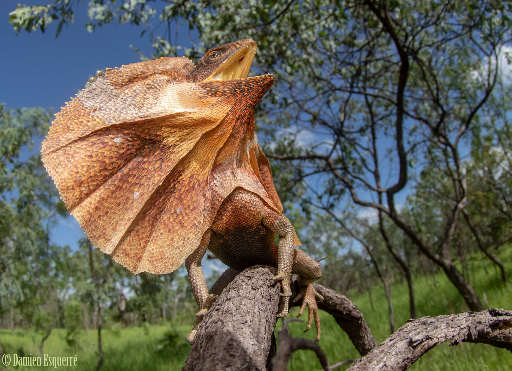

```{r setup, include=FALSE}
knitr::opts_chunk$set(echo = TRUE)
```

### **The Stuff that's Always Here**

1.  ::: panel-tabset
    ## Learning objectives {.active}

    -   Work with spatial data: points and polygons

    -   Visualise spatial data on maps

    -   Make decisions about cleaning data

    -   Produce simple species distribution models

    ## Ground rules

    Here are a few ground rules to keep things running smoothly:

    1)  Do your best to attempt each task on your own before asking for help from the instructors or your neighbour

    2)  When you get to a green box, stick the [green]{style="color:green;"} Post-it on your laptop where we can see it

    3)  If you need help, stick the [red]{style="color:red;"} Post-it on your laptop

    ## Getting un-stuck

    Remember, no programmers know it all, so don’t struggle alone too long, but before you ask for help do try:

    -   googling for what you want to do (e.g. ‘set point transparency in ggplot’)

    -   googling the error message if you get one (try putting it in double quotes)

    -   searching stack overflow for what you want try using tags (e.g. \[ggplot\]) to narrow down your search, e.g. search \[ggplot2\] adjust point transparency

    -   use the amazing R studio cheat sheets

    -   ask ChatGPT or Gemini for help (they are good at R!)

    -   asking your neighbours if they can help (remember to be generous with your time if someone asks you!)

    -   try explaining to an imaginary person exactly what you’re trying to do

    -   try working from the examples in the help files (e.g. type ?geom_point in the console and look down to the examples)

    If none of this works, use your [red]{style="color:red;"} Post-it to get help from a demonstrator.

    ## Before you begin

    Do this at the start of the workshop. For the git commits in this part, you do not need to have descriptions (though you can add them if you prefer).

    1.  On github.com create a new private repo called DS4B_Week_N, where N is the week of the semester (e.g. DS4B_Week_4)

    2.  Add the GitHub user DS4B-ANU (https://github.com/DS4B-ANU) as a collaborator using these instructions.

    3.  Clone your repository to your computer using GitHub Desktop. The new folder on your computer is what is known as the ‘root’ directory of your repository.

    4.  Create a .gitignore file as follows:

        -   In RStudio, use the dialog box in the top left to bring up the menu to add files

        -   Choose “Text File”

        -   Add the line .Rproj.user/ to your text file

        -   Add other lines for files you need to ignore (e.g. you might like to add .DS_Store if you use a mac)

        -   Save the text file in the root directory of your repo, and call it .gitignore

        -   Commit and push your changes using GitHub Desktop

    5.  Create a new R project as follows:

        -   Open RStudio

        -   Create a new R project for this workshop using the dialog button at the top left

        -   Choose “Existing Folder” when the dialog comes up

        -   Choose the root directory of your new repo as the folder in which to create your R project (the folder will be DS4B_Week_N as above, where N is the week of the semester)

        -   Create the R project Commit and push your changes using GitHub Desktop

    6.  Now we add the raw data as follows:

        -   Create a folder in the root directory of your repo called data

        -   Download the raw data for this workshop from Canvas

        -   Save it in the data folder

        -   Commit and push your changes using GitHub Desktop.

    7.  Now we create the R Markdown file as follows:

        -   In RStudio, use the dialog box in the top left to bring up the menu to add files

        -   Choose “R Markdown”

        -   Give it the title workshop_solutions.rmd

        -   Save it in the root directory of your repo

        -   Delete the contents of the R markdown file

        -   Replace the contents with the following markdown template:

            ````
            ---
            title: "BIOL3207 Workshop Solutions"
            author: "UXXXXXXX"
            date: "YYYY-MM-DD"
            output: html_document
            ---

            ```{r setup, include=FALSE}
            knitr::opts_chunk$set(echo = TRUE)
            ```

            ## Introduction

            ## Making Maps

            ## Cleaning the Data

            ## Geometric Species Distribution Models
            ````

        -   Enter your U number and the date where indicated

        -   Knit your R markdown file to html in RStudio

        -   Check the html file works by opening it in your browser

        -   Commit and push your changes using GitHub Desktop.

    8.  Open your repo on github.com, and ensure that:

        -   You have added DS4B-ANU (https://github.com/DS4B-ANU) as a collaborator

        -   Your root directory contains:

            -   a .gitignore file (containing at least the single line .Rproj.user/)

            -   a data/ folder

            -   the data files downloaded from Canvas in the data/ folder

            -   a .Rproj file with the same name as the repo (e.g. Practice_1.Rproj)

            -   a workshop_solutions.rmd file, updated as above

            -   a workshop_solutions.html file, knitted from the .rmd file

            -   nothing else!

        -   If any of these need fixing, fix them then use GitHub Desktop to commit and push your changes.

    ## Remember it’s a lab book

    Through this and every workshop, you should type as much descriptive text into your R Markdown document as someone (including but not limited to you) would need to understand what you’re doing.

    Remember: This document is your lab book! The information in it must be sufficient to reproduce your research, allow others to understand your way of thinking, and allow you to use it in your later work (e.g. when writing assessments, theses, blogs or papers). Imagine that you are writing a manual and a report at the same time.

    Please keep the level 1 headings we have given you above, so it’s easy for us to come around and help you. Please use subheadings to divide up your work within each section, subheadings work like this:

    ```{r}
    ## This is a level 2 subheading
    ### This is a level 3 subheading
    ```
    :::

## Introduction

Before you start, first make sure you’ve set up your github repo correctly following the instructions in the “Before You Begin” section above.

Today we are going to learn to work with with one of the most commonly used spatial data types in R - observation records. Observation records are point samples where a variable of interest and the geographic coordinates, in latitude and longitude, have been recorded. Observation data in this format could record all kinds of information, from the location of McDonalds restaurants, to the presence of recorded cases of particular Covid-19 strains, to sightings of organisms in the wild.

Today, we will focus on the latter. We will start by taking occurrence records for one of Australia's most iconic vertebrate species - the Frilled Lizard (*Chlamydosaurus kingii*) - from the Atlas of Living Australia (ALA) and identifying common errors or biases in spatial data. We will look at how to clean and subset the data in preparation for modeling the species distribution using a niche model next week.

{fig-align="center"}

::: callout-note
## About the Frilled Lizard
The Frilled Lizard (*Chlamydosaurus kingii*) is found across tropical savanna woodlands and dry forests in northern Australia and southern New Guinea. It is strongly associated with open woodland habitats that have a grassy understorey, and relies on trees for shelter, foraging, and its characteristic threat display. The species is currently listed as Least Concern by the IUCN, though its range may be shifting in response to changing fire regimes and climate. Keep this ecological context in mind throughout the workshop — it will help you judge whether modelled distributions make biological sense.
:::

### The Data

The ALA is a collaborative, digital, open infrastructure that pulls together Australian biodiversity data from multiple sources, making it accessible and reusable. It hosts an enormous amount of open source biodiversity data that can be readily downloaded, and even has it's own R package to help do so ('galah'), which will be touched on in week 9.

I got todays data directly from the ALA website and I'll explain how I got this and whats in the dataset. Every dataset downloaded from ALA is given a Digital Object Identifier (DOI) so anyone can download the exact same one. Here is our one for the [Frilled Lizard](https://doi.org/10.26197/ala.2e4809b8-791f-4adb-b1aa-f3e0fd94f86a), but you should have also already downloaded this from Canvas.

#### Task 1. Exploring the data frame (10 minutes)

The data has lots of columns, use `kable` to look at them to get an idea of the kinds of information are recorded in the ALA. Pay attention to ones that explicitly record taxonomic information (e.g. species, genus, family), ecological information (e.g. habitat, behaviour), and spatial information (e.g. latitude, longitude, place names).

Summarise the missingness for each variable. Use `ggplot2` to produce a histogram (`geom_histogram`) of the amount of missing data. What shape is the distribution?

Ask yourself:

-   How much missing data is there?

-   What sorts of information are reliably recorded

-   What sorts of information are often not recorded

```{r}
library(tidyverse)
library(knitr)

# read csv
occ <- read_csv("data/frilled_lizard_ALA.csv")

# inspect 
occ %>% 
  head %>% 
  kable

# how much missing data for each variable?
tibble(
  column = names(occ),
  n_missing = colSums(is.na(occ)),
  pct_missing = colMeans(is.na(occ)) * 100
) %>% 
  arrange(desc(pct_missing))%>% 
  head(100) %>% 
  kable
```

::: callout-tip
## Hint
Use the `missingness_table` you created above (or a similar tibble) as input to `ggplot()`. Map `n_missing` to the x-axis and use `geom_histogram()`. If you get stuck, check the `.qmd` source file for a worked solution.
:::

```{r, echo=F}
# solution
library(ggplot2)

missingness_table <- tibble(
  column = names(occ),
  n_missing = colSums(is.na(occ)),
  pct_missing = colMeans(is.na(occ)) * 100
)

ggplot(missingness_table, aes(x=n_missing))+
  geom_histogram()+
  theme_classic()
```

## Making Maps

Before modelling species distributions, it is always worth looking at your data on a map. Visualising occurrence records helps you quickly identify potential problems such as spatial clustering, sampling bias, coordinate errors, or large gaps in coverage.

We will use the sf package to handle spatial data in R. The `sf` package stores geographic features as simple objects — for example, points defined by longitude and latitude.

We will then use `leaflet` to build an interactive map that allows you to zoom, pan, and explore the data dynamically.

Before we begin, we need to load a world coastline polygon. We will use this later to crop our spatial data so we are not estimating species ranges in the ocean.

```{r}
library(rnaturalearth)

# Load world coastline polygon (we will use this later for cropping)
world <- ne_countries(scale = "medium", returnclass = "sf")
```

#### **Task 2. Explore the spatial data (20 minutes)**

Inspect where occurrence records are located.

Ask yourself:

-   Are records evenly distributed across the species range?

-   Do you see clustering near roads, cities, or coastlines?

-   Are some regions heavily sampled while others have very few records?

-   Why might these patterns occur?

These kinds of biases are extremely common in ecological data and can strongly influence downstream models.

##### **Prepare the spatial data**

```{r}
library(dplyr)
library(sf)

# Remove records with missing coordinates
occ <- occ %>%
  filter(!is.na(decimalLongitude),
         !is.na(decimalLatitude))

# Convert to spatial points (WGS84 = global GPS coordinate system)
occ_sf <- st_as_sf(
  occ,
  coords = c("decimalLongitude", "decimalLatitude"),
  crs = 4326
)
```

##### **Build an interactive map**

Now we add a proper basemap with roads, place names, and terrain.

```{r}
library(leaflet)

leaflet(occ_sf) |>
  
  # Add a detailed basemap
  addProviderTiles(providers$OpenStreetMap.Mapnik) |> 
  
  # Plot occurrence records
  addCircleMarkers(
    radius = 5,
    fillOpacity = 0.7,
    stroke = FALSE,
    color = "#2C7FB8"
  ) 
```

::: callout-tip
## Reminder: Knit, Commit, Push!
:::

## Cleaning the Data

Real-world biodiversity data is rarely perfect. Occurrence datasets often contain records that do not reflect wild populations - including coordinate errors, museum specimens, introduced species, or data entry mistakes.

Before doing anything with occurrence records, it is essential to ask: *do the points reflect the species' natural distribution?*

One powerful way to evaluate this is by comparing occurrence records to an expert-derived range map.

For many taxa, the International Union for the Conservation of Nature (IUCN) provides carefully reviewed distributions created by species experts. These maps are not flawless, but they provide a baseline for data cleaning.

For example, the Frilled Lizard was assessed by the IUCN in 2014: <https://www.iucnredlist.org/species/170384/21644690>

#### **Task 3. Compare expert range vs occurrence records (20 minutes)**

We will now load the IUCN range polygon and compare it to the occurrence records. Plot the datasets together and inspect where they agree and where they don’t.

Ask yourself:

-   Which dataset (point or polygon) likely overestimates the species range?

-   Which might underestimate it?

-   Where do you see obvious errors?

-   Are there plausible records just outside the polygon?

-   Why might some areas inside the polygon have no observations?

##### **Load the IUCN spatial polygon**

Shapefiles are a common spatial format that actually consist of several linked files (.shp, .dbf, .prj, etc.). The sf package reads these in the background.

```{r}
library(sf)

iucn_sf <- st_read("data/frilled_lizard.shp")
```

##### **Build an interactive map**

```{r}
leaflet(occ_sf) |>
  
  # Add a detailed basemap
  addProviderTiles(providers$OpenStreetMap.Mapnik) |> 
  
  # Plot occurrence records
  addCircleMarkers(
    radius = 5,
    fillOpacity = 0.7,
    stroke = FALSE,
    color = "#2C7FB8"
  ) |>
    addPolygons(
    data = iucn_sf,
    fillColor = "#009E73",
    color = "#007F5F",
    weight = 1,
    fillOpacity = 0.4,
    popup = "IUCN Distribution"
  )
```

### **Cropping to the Expert Range**

One simple approach to cleaning the data would be to keep only records that fall inside the IUCN polygon. This effectively delegates quality control to the expert panel.

However, you may have noticed some clusters of occurrences just outside the polygon that look entirely plausible. So instead of cropping exactly to the polygon, we can create a buffer zone around it.

A buffer allows us to:

-   retain likely true observations

-   remove obvious outliers

-   account for mapping uncertainty

-   capture populations near shifting range boundaries

#### **Task 4 — Explore buffer distances (≈20 minutes)**

Selecting an appropriate buffer distance to remove potentially erroneous points is a difficult task as there is not necessarily a set of hard-and-fast rules. We want to balance including points that could reasonably be considered part of the species range without including obviously wrong points.

For this section you will write the code to create an object `buffer_iucn`. Use `st_buffer` to extend the IUCN polygon by choosing a distance (e.g. `dist = 50000` will be a distance of 50km). Use `leaflet` to plot three different buffer sizes of your choice. Your favourite of these should be named `buffer_iucn` and will be used later on.

Ask yourself:

-   Which buffer removes obvious errors?

-   Which keeps plausible (i.e. reasonable/believable) edge populations?

-   At what point does the buffer become biologically unrealistic?

##### ⚠️ Important Point 1

Buffers measured in longitude/latitude can behave strangely because degrees are not equal distances across the globe (one degree of longitude is much smaller near the poles than at the equator). So first, we project the data into a **coordinate reference system (CRS) measured in metres**. CRS 3577 is an Australian equal-area projection. After creating buffers, you **must** transform back to CRS 4326 (the standard latitude/longitude system) for mapping with `leaflet`.

```{r}
# Project to an Australian equal-area CRS (units = metres)
iucn_proj <- st_transform(iucn_sf, crs=3577)
occ_proj <- st_transform(occ_sf, crs= 3577)
```

##### ⚠️ Important Point 2

You can crop the buffer by the coastlines, so you don't estimate part of the range in the ocean. This requires first disabling spherical geometry to avoid errors due to the `world` polygon wrapping around the globe.

##### Worked example

Here is a worked example showing the full workflow for a single buffer. Use this as a template to create three buffers of different sizes, then plot them together with `leaflet`.

```{r}
# Step 1: Create a buffer (this example uses 50 km)
buffer_50km <- st_buffer(iucn_proj, dist = 50000)

# Step 2: Transform back to lat/lon for mapping
buffer_50km <- st_transform(buffer_50km, crs = 4326)

# Step 3: Crop by coastline to remove ocean areas
sf_use_s2(FALSE)
buffer_50km <- st_intersection(st_make_valid(buffer_50km), world)
sf_use_s2(TRUE)
```

Now create at least two more buffers of different sizes (e.g. 100 km, 200 km, 500 km) using the same steps. Plot all three on a `leaflet` map together with the occurrence points and the IUCN polygon, using different colours for each buffer. Assign your preferred buffer to the variable `buffer_iucn`:

```{r}
# YOUR CODE HERE: create additional buffers, plot them, then assign your favourite:
# buffer_iucn <- buffer_XXXXX
```

```{r, echo=F}
# Solution

buffer_100km <- st_buffer(iucn_proj, dist = 100000)
buffer_200km <- st_buffer(iucn_proj, dist = 200000)
buffer_500km  <- st_buffer(iucn_proj, dist = 500000)

buffer_100km <- st_transform(buffer_100km, 4326)
buffer_200km <- st_transform(buffer_200km, 4326)
buffer_500km <- st_transform(buffer_500km, 4326)

# Disable spherical geometry to avoid errors
sf_use_s2(FALSE)

# Crop buffer by coastline
buffer_100km <- st_intersection(st_make_valid(buffer_100km), world)
buffer_200km <- st_intersection(st_make_valid(buffer_200km), world)
buffer_500km <- st_intersection(st_make_valid(buffer_500km), world)

# Re-enable spherical geometry
sf_use_s2(TRUE)

# Plot
leaflet(occ_sf) |>
  
  # Add a detailed basemap
  addProviderTiles(providers$OpenStreetMap.Mapnik) |> 
  
  # Plot occurrence records
  addCircleMarkers(
    radius = 5,
    fillOpacity = 0.7,
    stroke = FALSE,
    color = "#2C7FB8"
  ) |>
  
  # IUCN polygon
  addPolygons(
    data = iucn_sf,
    fillColor = "#009E73",   # green
    color = "#007F5F",
    weight = 2,
    fillOpacity = 0.3,
    popup = "IUCN Range"
  ) |>
  
  # 50 km buffer
  addPolygons(
    data = buffer_100km,
    fillColor = "#FFD700",   # gold
    color = "#B8860B",
    weight = 1,
    fillOpacity = 0.1,
    popup = "100 km buffer"
  ) |>
  
  # 100 km buffer
  addPolygons(
    data = buffer_200km,
    fillColor = "#FFA500",   # orange
    color = "#FF8C00",
    weight = 1,
    fillOpacity = 0.1,
    popup = "200 km buffer"
  ) |>
  
  # 200 km buffer
  addPolygons(
    data = buffer_500km,
    fillColor = "#FF4500",   # red-orange
    color = "#B22222",
    weight = 1,
    fillOpacity = 0.1,
    popup = "500 km buffer"
  )


buffer_iucn <- buffer_200km
```

#### **Task 5. Crop Occurrence Records with Buffer**

After exploring the IUCN polygon and buffers, we now want to subset our occurrence records to include only points that fall within a chosen buffer around the expert range.

1.  Select a buffer size

2.  Keep only occurrence points that fall inside that buffer using `st_within`

3.  Save the cleaned data for future use using `write_csv`

```{r}
# subset only the points that fall within the polygon
occ_cropped <- occ_sf[lengths(st_within(occ_sf, buffer_iucn)) > 0, ]

# create a data frame and we'll save it for use in next week's prac
occ_cropped_df <- as_tibble(st_coordinates(occ_cropped))

# write it as a csv
write_csv(occ_cropped_df, file="data/frilled_lizard_ALA_cropped.csv")

```

Now we have a roughly cleaned data set of species occurrences from ALA. We are happy that they fall within the likely range of the Frilled Lizard. However, we have noted that both the IUCN polygon and ALA occurrence records each have biases which mean they might over- or under-estimate the species range.

::: callout-tip
## Reminder: Knit, Commit, Push!
:::

## Geometric Species Distribution Models

In the final part of this week's workshop, we will estimate the species’ range from occurrence records.

Species distribution models (SDMs) aim to reconstruct where a species is likely to occur. Today we’ll start with the simplest, **geometric models**, which rely only on the spatial distribution of known points. Next week, we’ll explore environmental niche models that consider habitat suitability.

A **convex hull** (or minimum convex polygon, MCP) is one of the easiest ways to estimate a species’ range. It is the smallest polygon that encloses all occurrence points and has only convex angles (\< 180°).

#### **Task 6. Build a convex hull**

-   Extract the coordinates from your cleaned occurrence dataset.

-   Compute the convex hull using the `chull()` function.

-   Convert the hull coordinates into an `sf` polygon.

-   Crop the hull by the coastline to remove areas in the ocean.

```{r}
# Extract coordinates
coords <- st_coordinates(occ_cropped)
lon <- coords[, "X"]
lat <- coords[, "Y"]

# Compute convex hull indices
hull_indices <- chull(lon, lat)

# Close the polygon by repeating the first point
hull_indices <- c(hull_indices, hull_indices[1])

# Create matrix of hull coordinates
hull_coords <- cbind(lon[hull_indices], lat[hull_indices])

# Convert to sf polygon
hull_polygon <- st_polygon(list(hull_coords))
hull_sf <- st_sfc(hull_polygon, crs = 4326)
hull_sf <- st_sf(geometry = hull_sf)

# Crop by coastline to remove ocean areas
sf_use_s2(FALSE)
hull_sf <- st_intersection(st_make_valid(hull_sf), world)
sf_use_s2(TRUE)

```

**Alpha hulls**, on the other hand, allow **concave polygons**, producing a tighter, more realistic range envelope. The alpha value controls the degree of concavity. Smaller alpha values give a tighter, more concave polygon, larger alpha values give a looser, more convex polygon.

#### **Task 7. Build alpha hulls**

1.  Install the packages `alphahull` and `hull2spatial`

```{r}
# hull2spatial is from GitHub not CRAN
remotes::install_github("babichmorrowc/hull2spatial")
library(hull2spatial)
library(alphahull)
library(sp)
```

2.  Choose an alpha value (generally \< 10).

3.  Compute the alpha hull from your occurrence points.

4.  Convert the alpha hull to an `sf` object for plotting.

5.  Crop by the coastline

```{r}
# Choose an alpha value (experiment with values < 10)
alpha <- 5

# Prepare coordinates
xy_df <- data.frame(x = lon, y = lat)
xy_df <- unique(round(xy_df, 4))

# Compute alpha hull
ahull_obj <- ahull(xy_df, alpha = alpha)

# Convert to sf polygon
# Note: the code below converts between older (sp) and newer (sf) spatial formats.
# You do not need to understand every line — just run it and check that ahull_sf is created.
ahull_spatial <- ahull2poly(ahull_obj)
sub_polys <- slot(ahull_spatial, "polygons")

# Convert each sub-polygon to sf
poly_list <- lapply(seq_along(sub_polys), function(i) {
  SpatialPolygons(list(sub_polys[[i]]), proj4string = CRS(proj4string(ahull_spatial)))
})
sf_list <- lapply(poly_list, st_as_sf)
ahull_sf <- do.call(rbind, sf_list)
ahull_sf$id <- seq_len(nrow(ahull_sf))
st_crs(ahull_sf) <- 4326

# Crop by coastline
sf_use_s2(FALSE)
ahull_sf <- st_intersection(st_make_valid(ahull_sf), world)
sf_use_s2(TRUE)
```

#### **Task 8. Compare all layers**

Now visualise everything together: occurrences, buffers, IUCN range, convex hull, and alpha hull, based on what you've learned using `leaflet`. Build your map by starting with `leaflet() |> addProviderTiles(...)` and adding layers one at a time with `addCircleMarkers()` for points and `addPolygons()` for polygons. Use different colours for each layer so you can distinguish them. If you get stuck, check the `.qmd` source file for a worked solution.

```{r,echo =F}

# Solution
leaflet(occ_sf) |>
  
  # Add a detailed basemap
  addProviderTiles(providers$OpenStreetMap.Mapnik) |> 
  
  # Plot occurrence records
  addCircleMarkers(
    radius = 5,
    fillOpacity = 0.7,
    stroke = FALSE,
    color = "#2C7FB8"
  ) |>
  
  # IUCN polygon
  addPolygons(
    data = iucn_sf,
    fillColor = "#009E73",   # green
    color = "#007F5F",
    weight = 2,
    fillOpacity = 0.1,
    popup = "IUCN Range"
  ) |>
  
  # 50 km buffer
  addPolygons(
    data = hull_sf,
    fillColor = "#FFD700",   # gold
    color = "#B8860B",
    weight = 1,
    fillOpacity = 0.1,
    popup = "convex hull"
  ) |>
  
  # 100 km buffer
  addPolygons(
    data = ahull_sf,
    fillColor = "#FFA500",   # orange
    color = "#FF8C00",
    weight = 1,
    fillOpacity = 0.1,
    popup = "alpha hull"
  ) |>
  
  # 200 km buffer
  addPolygons(
    data = buffer_200km,
    fillColor = "#FF4500",   # red-orange
    color = "#B22222",
    weight = 1,
    fillOpacity = 0.1,
    popup = "200 km buffer"
  )


```

Ask Yourself:

-   Which method (buffer, convex hull, alpha hull) best represents the known distribution?

-   How do assumptions differ between layers?

-   What are the trade-offs between simplicity (convex hull) and realism (alpha hull)?

Lastly, save the alpha hull as we will use it again in next week's workshop.

```{r}
# use the sf package
sf::st_write(ahull_sf, "data/frilled_lizard_alpha_hull.shp", delete_layer = TRUE)

# If you get an error, try using the terra package instead:
terra::writeVector(vect(ahull_sf), "data/frilled_lizard_alpha_hull.shp")
```

::: callout-tip
## ✅ Check out!

Once you’ve completed the workshop up to this point (not including any of the Going Further section), you are welcome to check out. **But first, knit, commit, and push!**

If you’d like to stay and complete the ‘Going Further’ section, you’re welcome to do so — but please check out first.

**Before checking out, make sure you have:**

-   Cleaned occurrence data saved as a CSV (`data/frilled_lizard_ALA_cropped.csv`)
-   An alpha hull saved as a shapefile (`data/frilled_lizard_alpha_hull.shp`)
-   At least one leaflet map comparing different range estimation methods
-   Written reflections on the "Ask yourself" questions in your `.rmd`
-   Your `.rmd` knits to `.html` without errors

**To check out:** bring your laptop to Alex, Rob, or a demonstrator with both your `.rmd` and `.html` files open.
:::

## Going Further

### (1) Range Change Through Time

Given the rapid rate of climate and land use change in Australia, we might want to ask whether there is a signal of range shifting through time in the occurrence of a species. For example, if a species range was expanding there may be records present in an area where they were absent historically. Based on all the skills you've learned in this workshop have a go at creating two alternative range maps - a historical and a contemporary - for the Frilled Lizard.

To do this, first split the data into two subsets based on the variable `year`. Do we see a difference in the geographic range prior to and post the year 2000?
